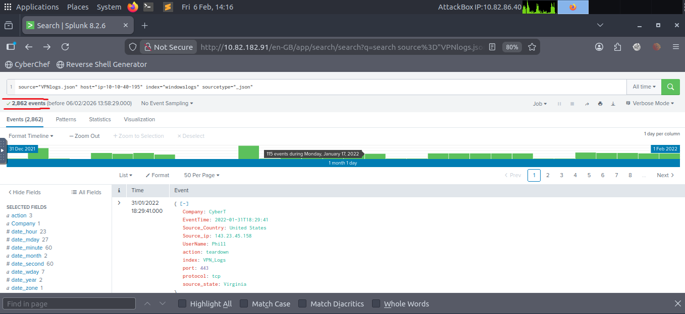
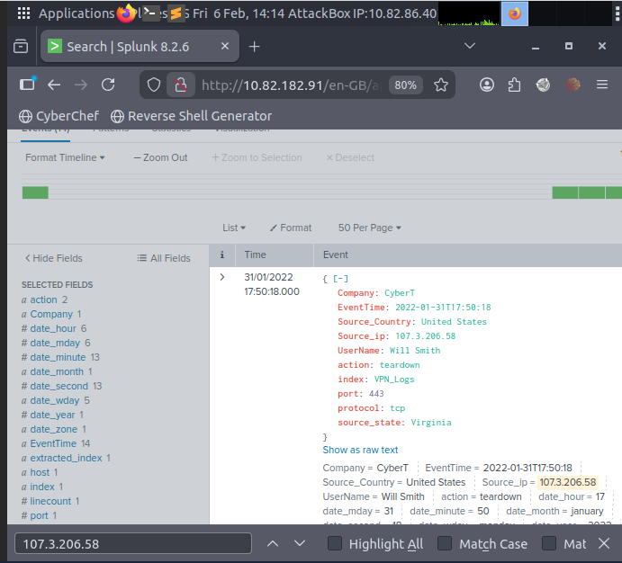

# Splunk SIEM Fundamentals

This repository documents my hands-on learning and practical experience with Splunk SIEM, focusing on log ingestion, event analysis, and security monitoring.

## Platform
TryHackMe

## Module Completed
Splunk Basics

## Skills Acquired

- SIEM log ingestion and analysis
- Splunk architecture understanding (Forwarder, Indexer, Search Head)
- VPN log investigation
- Event filtering and correlation
- Security event analysis
- SOC analyst workflow simulation
- Field-based investigation in Splunk
- Index creation and data ingestion

## Practical Activities

- Uploaded VPN log dataset
- Created and used indexes
- Investigated specific IP addresses
- Analyzed user activity logs
- Identified event patterns

## SIEM Concepts Covered

- Log ingestion
- Event normalization
- Event indexing
- Search and filtering
- Field extraction
- Incident investigation workflow

